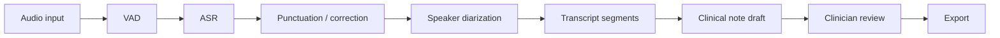

# Architecture

## Runtime Flow

## Core Modules

- `code/service/backend/api`: FastAPI routers.
- `code/service/backend/processors`: ASR, VAD, speaker, and streaming logic.
- `code/service/backend/services`: API-facing service classes.
- `code/service/backend/models`: model manager and text corrector.
- `code/service/backend/clinical`: structured note schemas and draft generator.

## v0.1 Safety Design

- ASR model loading is lazy.
- Clinical note drafting can run from transcript JSON without ASR models.
- The draft generator is deterministic and evidence-led.
- Missing facts are marked as missing.
- Every populated section includes transcript quotes.

