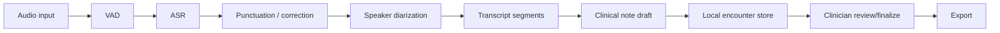

# Architecture

## Runtime Flow

## Core Modules

- `code/service/backend/api`: FastAPI routers.
- `code/service/backend/processors`: ASR, VAD, speaker, and streaming logic.
- `code/service/backend/services`: API-facing service classes.
- `code/service/backend/models`: model manager and text corrector.
- `code/service/backend/clinical`: structured note schemas and draft generator.
- `code/service/web`: first-party static browser workbench served at `/app`.
- `data/encounters`: local JSON records for drafts, final notes, and exports.

## v0.1 Safety Design

- ASR model loading is lazy.
- Clinical note drafting can run from transcript JSON without ASR models.
- The draft generator is deterministic and evidence-led.
- Missing facts are marked as missing.
- Every populated section includes transcript quotes.

## v0.2 Persistence Design

- Draft generation saves an encounter record automatically.
- Finalization stores clinician-reviewed sections separately from the draft.
- Markdown export prefers finalized content when available.
- JSON export returns the full local encounter record.

## v0.4 Workbench Design

- FastAPI serves static product assets from `/assets`.
- `/app` loads the workbench without a separate frontend build step.
- The browser UI uses the same public REST endpoints as external clients.
- The workbench supports draft generation, section editing, finalization,
  Markdown/JSON export, saved encounter browsing, and runtime capability checks.
